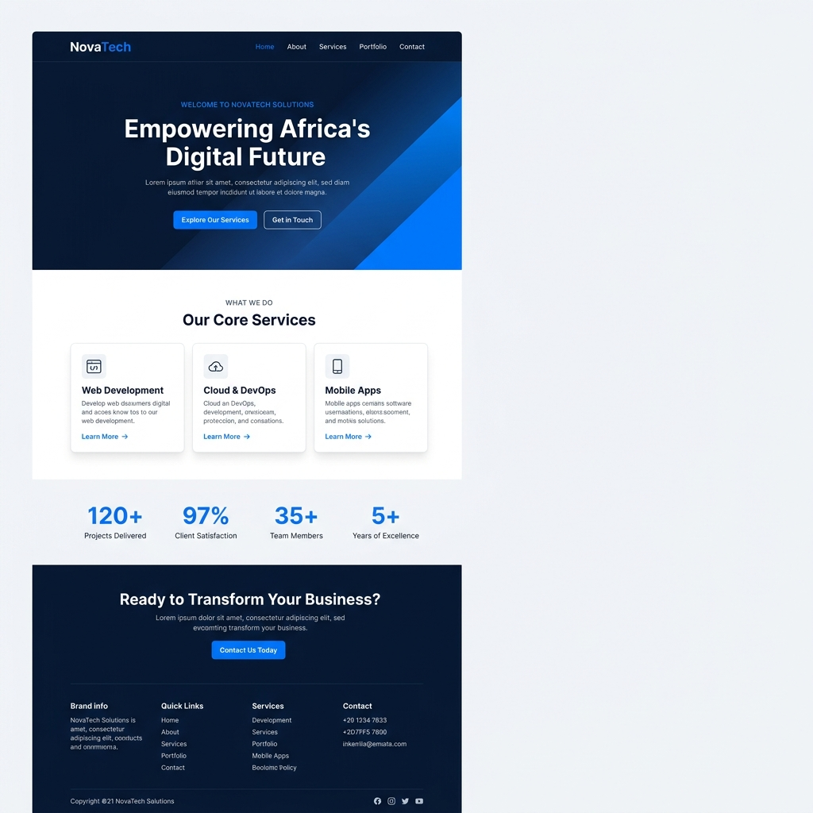
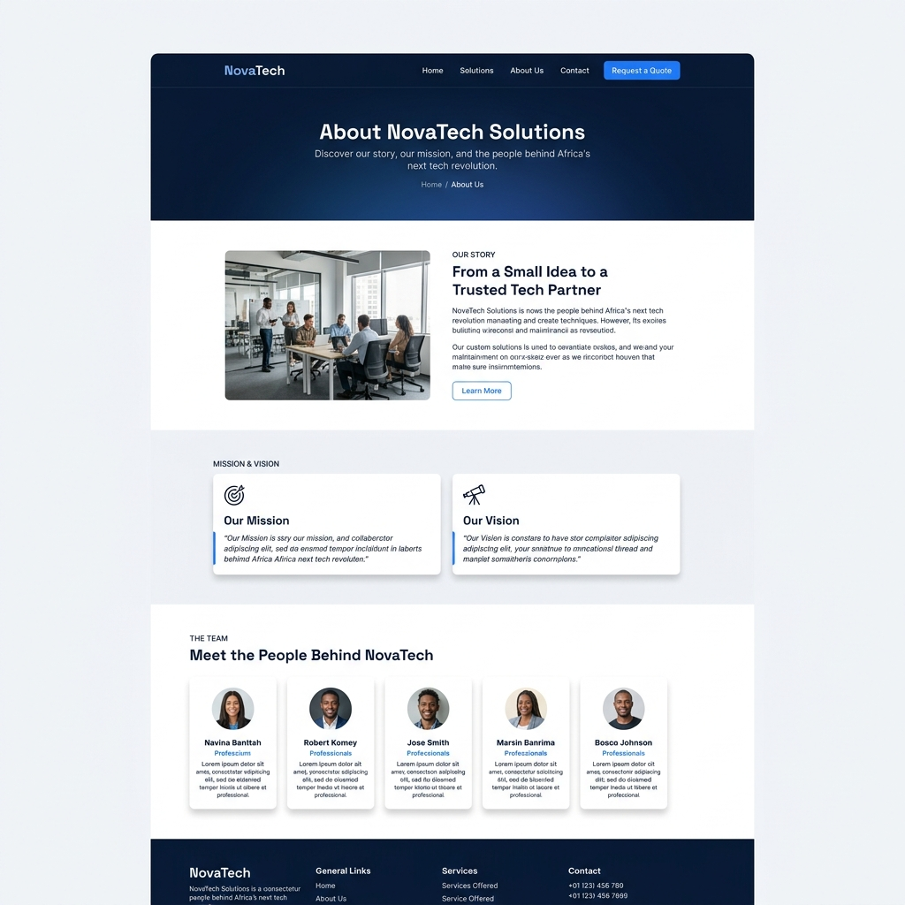
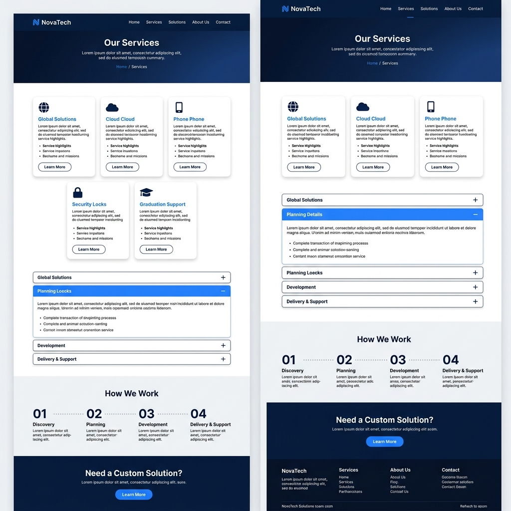
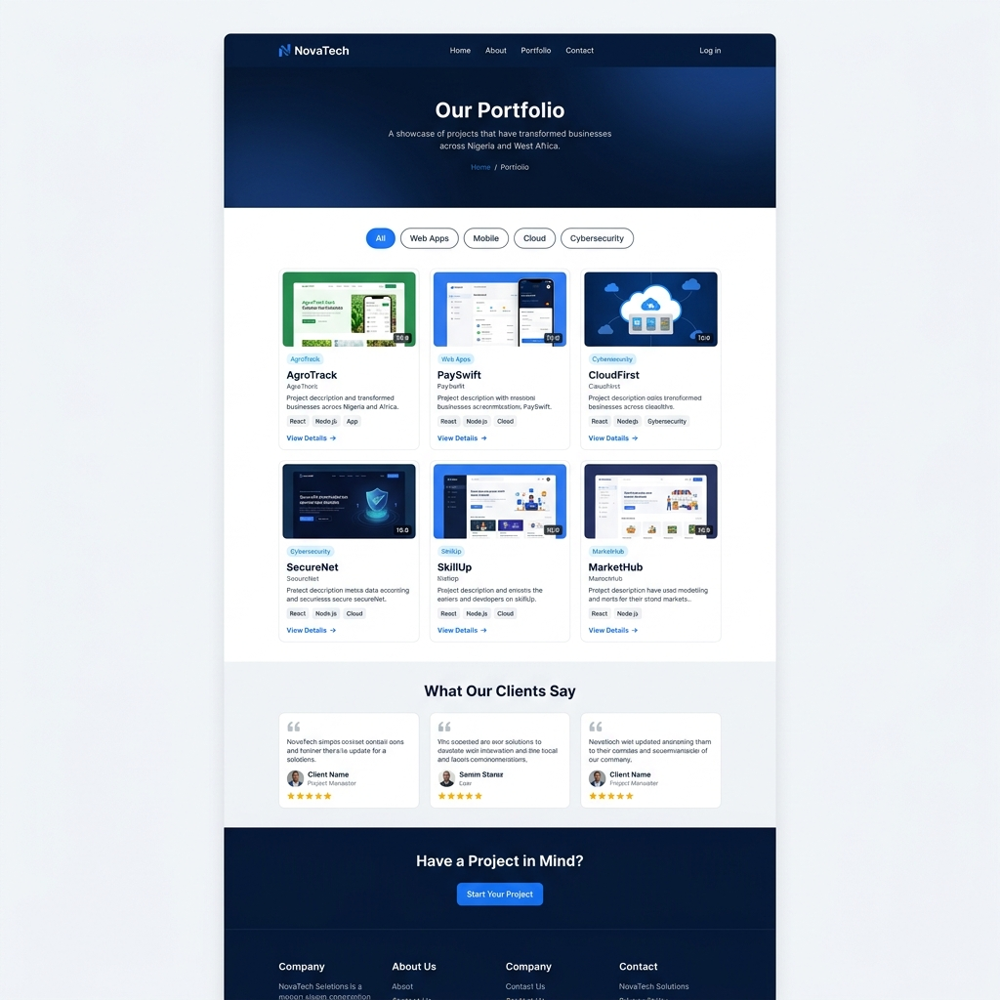
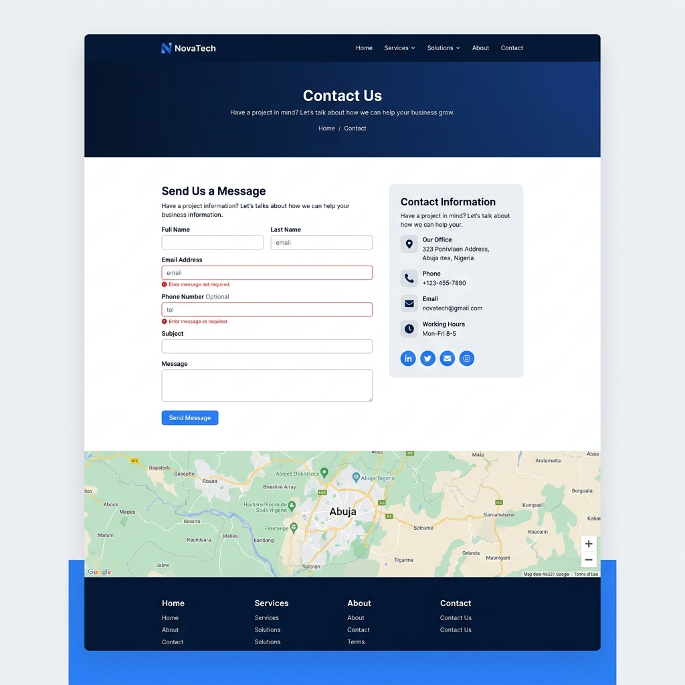

# NovaTech Solutions — Company Website


> 🚀 A responsive, multi-page company website built with HTML, CSS, and JavaScript for a fictional IT services company based in Abuja, Nigeria.

[]()
[]()
[]()
[]()

---

## 📌 About This Project

This is my quarter assessment project for the **3LOGY Software Development Bootcamp (2026)**. The objective was to build a professional, responsive, multi-page website for **NovaTech Solutions** — a fictional IT services and software solutions company — using only vanilla HTML, CSS, and JavaScript. No frameworks or libraries were used.

**[🔗 View Live Site →]** [Replace with your GitHub Pages or Netlify URL, or write "Open `index.html` in a browser"]

---

## 📸 Screenshots

> **Instructions:** Replace the mockup images below with actual screenshots of **your completed pages**. Take screenshots at desktop width (~1200px). Save them in `docs/screenshots/` and update the paths below.

### Homepage

<!-- ✏️ REPLACE with your screenshot:  -->

### About Page

<!-- ✏️ REPLACE with your screenshot:  -->

### Services Page

<!-- ✏️ REPLACE with your screenshot:  -->

### Portfolio Page

<!-- ✏️ REPLACE with your screenshot:  -->

### Contact Page

<!-- ✏️ REPLACE with your screenshot:  -->

---

## 🛠️ Technologies Used

| Technology | Version | Purpose |
| ---------- | ------- | ------- |
| **HTML5** | 5 | Page structure and semantic markup |
| **CSS3** | 3 | Styling, layout (Flexbox & Grid), animations, responsive design |
| **JavaScript** | ES6 | DOM manipulation, form validation, interactive components |
| **Google Fonts** | — | Typography: Space Grotesk (headings) + Inter (body) |
| **[Any other tool]** | — | [Purpose — e.g., "TinyPNG for image compression"] |

> **No frameworks or libraries were used.** This project is built entirely with vanilla HTML, CSS, and JavaScript as required by the assessment brief.

---

## 📂 Project Structure

```
NovaTech-Company-Website/
│
├── index.html                  ← Homepage
├── about.html                  ← About Us page
├── services.html               ← Services page
├── portfolio.html              ← Portfolio page
├── contact.html                ← Contact page
│
├── assets/
│   ├── css/
│   │   └── styles.css          ← Main stylesheet (design system + custom styles)
│   ├── js/
│   │   └── main.js             ← All JavaScript functionality
│   ├── fonts/                  ← Custom fonts (if any)
│   └── images/
│       ├── logo.png            ← Primary logo
│       ├── logo-white.png      ← White logo for dark backgrounds
│       ├── hero/               ← Hero/banner background images
│       ├── team/               ← Team member photos
│       ├── services/           ← Service illustration images
│       ├── portfolio/          ← Project screenshots
│       ├── clients/            ← Client/testimonial photos
│       ├── about/              ← About page content images
│       └── icons/              ← Favicon & icon assets
│
├── docs/
│   ├── design/                 ← Design references & branding
│   │   ├── DESIGN-SYSTEM.md
│   │   ├── PROJECT-BRIEF.md
│   │   ├── LOGO-DESIGN-BRIEF.md
│   │   └── mockups/            ← UI design mockup images
│   ├── requirements/           ← Assessment specs & guides
│   │   ├── ASSESSMENT-INSTRUCTIONS.md
│   │   ├── PAGE-CONTENT-GUIDE.md
│   │   ├── JS-REQUIREMENTS.md
│   │   ├── IMAGE-REQUIREMENTS.md
│   │   └── FOLDER-STRUCTURE.md
│   └── screenshots/            ← README screenshots
│
├── README.md                   ← This file
└── .gitignore                  ← Git ignore rules
```

---

## 🚀 How to Run Locally

### Option 1: Direct File Open
```bash
# 1. Clone the repository
git clone https://github.com/[your-username]/NovaTech-Company-Website.git

# 2. Navigate to the project folder
cd NovaTech-Company-Website

# 3. Open in browser
# Simply double-click index.html or:
start index.html          # Windows
open index.html           # macOS
xdg-open index.html       # Linux
```

### Option 2: VS Code Live Server
1. Open the project folder in **VS Code**
2. Install the **Live Server** extension (by Ritwick Dey)
3. Right-click `index.html` → **"Open with Live Server"**
4. The website opens at `http://127.0.0.1:5500`

> 💡 **Recommended:** Use Live Server for automatic reloading when you make changes.

---

## 📄 Pages & Features

### Page Completion Status

> **Instructions:** Check off each feature as you complete it. Change `[ ]` to `[x]`.

#### Homepage (`index.html`)
- [ ] Hero section with company name, tagline, and CTA buttons
- [ ] Background image or gradient on hero
- [ ] Services overview section (3 service cards in responsive grid)
- [ ] Why Choose Us / Stats section (4 stats)
- [ ] Call-to-Action section
- [ ] Consistent navigation and footer

#### About Page (`about.html`)
- [ ] Page hero/banner with breadcrumb
- [ ] Company story section (2+ paragraphs)
- [ ] Mission & Vision (side-by-side cards)
- [ ] Meet the Team (4+ team member cards with photos)
- [ ] Consistent navigation and footer

#### Services Page (`services.html`)
- [ ] Page hero/banner with breadcrumb
- [ ] All 5 services displayed with icons, headings, and descriptions
- [ ] Interactive service detail (accordion / tabs / modal) — *circle which you chose*
- [ ] CTA section
- [ ] Consistent navigation and footer

#### Portfolio Page (`portfolio.html`)
- [ ] Page hero/banner with breadcrumb
- [ ] 4+ project showcase cards with images and descriptions
- [ ] Project detail view (modal, link, or detail section)
- [ ] CTA section
- [ ] Consistent navigation and footer

#### Contact Page (`contact.html`)
- [ ] Page hero/banner with breadcrumb
- [ ] Contact form with 5 fields (name, email, phone, subject, message)
- [ ] JavaScript form validation with error messages
- [ ] Company contact information displayed
- [ ] Consistent navigation and footer

#### Cross-Cutting
- [ ] Responsive navigation bar on all pages (with active link indicator)
- [ ] Mobile hamburger menu (functional with JavaScript)
- [ ] Footer with company info, quick links, and social icons on all pages
- [ ] Fully responsive design (desktop, tablet, mobile)
- [ ] Design system CSS variables used consistently (no hardcoded colors/fonts)

---

## ⚡ JavaScript Features Implemented

> **Instructions:** Check which features you implemented. For each one, briefly describe how it works.

### Required Features

- [ ] **Mobile Navigation Toggle**
  - Function: `initMobileNav()`
  - Description: [Briefly describe — e.g., "Clicking the hamburger button toggles the mobile nav menu. Menu closes when a link is clicked."]

- [ ] **Contact Form Validation**
  - Functions: `initContactForm()`, `showError()`, `clearErrors()`
  - Description: [Briefly describe — e.g., "Validates name, email, subject, and message fields on form submit. Shows inline error messages. Displays success message when all fields are valid."]

- [ ] **Service Interaction** — [Accordion / Tabs / Modal] *(circle one)*
  - Function: `initServiceAccordion()` / `initServiceTabs()` / `initServiceModal()`
  - Description: [Briefly describe — e.g., "Accordion component that expands to show full service details. Only one item open at a time."]

### Bonus Features (if implemented)

- [ ] **Scroll-to-Top Button** — `initScrollToTop()`
  - [Brief description of what it does]

- [ ] **Navbar Scroll Effect** — `initNavScroll()`
  - [Brief description of what it does]

- [ ] **Portfolio Filtering** — `initPortfolioFilter()`
  - [Brief description of what it does]

- [ ] **Dark Mode Toggle** — `initDarkMode()`
  - [Brief description of what it does]

- [ ] **Smooth Scroll** — `initSmoothScroll()`
  - [Brief description of what it does]

- [ ] **Typing Animation** — `initTypingEffect()`
  - [Brief description of what it does]

- [ ] **Other: [Feature Name]**
  - [Description]

---

## 🐛 Known Issues / Bugs

> **Instructions:** Be honest about any bugs or issues you're aware of. This shows maturity and self-awareness — real developers always track known issues.

| # | Issue | Page | Severity | Description |
| - | ----- | ---- | -------- | ----------- |
| 1 | [e.g., "Hero image loads slowly on mobile"] | [e.g., index.html] | [Low/Medium/High] | [Brief description of the issue and any workaround] |
| 2 | [Issue title] | [Page] | [Severity] | [Description] |
| 3 | [Issue title] | [Page] | [Severity] | [Description] |

> If you have **no known issues**, write: "No known bugs at the time of submission. Tested on Chrome, Firefox, and Safari."

---

## 🔮 Future Improvements

> **Instructions:** If you had more time, what would you add or change? List at least 3 improvements.

1. **[Improvement 1]** — [e.g., "Add page transition animations between pages using CSS keyframes"]
2. **[Improvement 2]** — [e.g., "Implement a working contact form backend using Formspree or EmailJS"]
3. **[Improvement 3]** — [e.g., "Add a blog page with article cards and a reading view"]
4. **[Improvement 4]** — [e.g., "Implement lazy loading for portfolio images to improve performance"]
5. **[Improvement 5]** — [e.g., "Add ARIA landmarks and improve keyboard navigation for accessibility"]

---

## 🎨 Design Decisions

> **Instructions:** Briefly explain any design choices you made that differ from or extend the provided design system.

- **[Decision 1]:** [e.g., "I chose the accordion interaction for the services page because it keeps all content on one page and reduces scrolling."]
- **[Decision 2]:** [e.g., "I added a subtle hover animation on team cards to make the page feel more interactive."]
- **[Decision 3]:** [e.g., "I used a pure CSS gradient for the hero instead of an image to improve load time."]

---

## 📚 Credits & Attributions

### Images
| Image | Source | License |
| ----- | ------ | ------- |
| [Hero background image] | [e.g., "Unsplash — Photo by [Photographer Name]"] | [e.g., "Unsplash License (free)"] |
| [Team member photos] | [e.g., "Pexels — searched 'professional headshot'"] | [e.g., "Pexels License (free)"] |
| [Portfolio mockups] | [e.g., "Smartmockups.com"] | [Free tier] |
| [Service icons] | [e.g., "Heroicons (heroicons.com)"] | [MIT License] |
| [Add more as needed] | | |

### Fonts
- **Space Grotesk** — [Google Fonts](https://fonts.google.com/specimen/Space+Grotesk) — SIL Open Font License
- **Inter** — [Google Fonts](https://fonts.google.com/specimen/Inter) — SIL Open Font License

### References & Resources
- [MDN Web Docs](https://developer.mozilla.org/) — HTML/CSS/JS reference
- [CSS-Tricks](https://css-tricks.com/) — Layout and styling techniques
- [W3C Validator](https://validator.w3.org/) — HTML validation
- 3LOGY Bootcamp course materials and lecture notes
- [Add any other resources you used]

### Design System
The color palette, typography, spacing system, and CSS custom properties were provided by the **3LOGY Bootcamp** as part of the assessment starter files.

---

## ✅ Pre-Submission Checklist

> **Instructions:** Go through this checklist before submitting. Ensure everything passes.

```
CODE QUALITY:
[ ] HTML passes W3C Validator with no errors
[ ] No console errors on any page (check with F12 → Console)
[ ] All files follow naming conventions (lowercase, hyphens)
[ ] Code is properly indented and organized
[ ] Meaningful class names and IDs used
[ ] Comments added to complex code sections

DESIGN:
[ ] Design system CSS variables used throughout (no hardcoded colors)
[ ] Consistent look across all 5 pages
[ ] All images have alt text
[ ] Proper heading hierarchy (one H1 per page)

RESPONSIVENESS:
[ ] Tested on Desktop (≥992px)
[ ] Tested on Tablet (768px–991px)
[ ] Tested on Mobile (≤767px)
[ ] Hamburger menu works on mobile
[ ] No horizontal scrollbar on any screen size

FUNCTIONALITY:
[ ] All navigation links work correctly
[ ] Active page indicator is correct on each page
[ ] Contact form validation works
[ ] Service interaction works (accordion/tabs/modal)
[ ] No JavaScript errors in console

SUBMISSION:
[ ] Code pushed to GitHub (public repository)
[ ] README.md completed with screenshots
[ ] Repository has a clear, descriptive name
[ ] All files are committed (no missing assets)
```

---

## 👤 Student Information

| Field | Details |
| ----- | ------- |
| **Full Name** | ABOI SAMSON ABOI|
| **GitHub Username** | [@aboisam](https://github.com/aboisam) |
| **Cohort / Group** | [e.g., "3LOGY Bootcamp — Cohort 2026 Q1"] |
| **Assessment** | Quarter Assessment — HTML, CSS & JavaScript |
| **Submission Date** | [16/May/2026] |
| **Live URL** | [GitHub Pages / Netlify link, or "N/A"] |

---

<p align="center">
  Built with ❤️ at <strong>3LOGY Software Development Bootcamp</strong> — 2026
</p>
